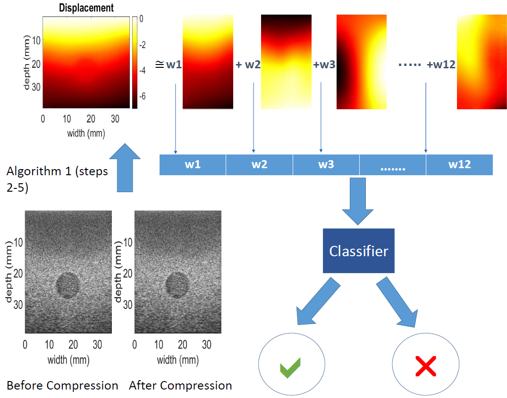

# PCA-GLUE for Ultrasound Elastography
PCA-GLUE is a method used for strain estimation in Ultrasound Elastography.

## What is it?
We introduce a method that learns 12 displacement modes in quasi-static elastography by performing Principal Component Analysis (PCA) on displacement fields of a large training database. In the inference stage, we use dynamic programming (DP) to compute an initial displacement estimate of around 1% of the samples, and then decompose this sparse displacement into a linear combination of the 12 displacement modes. Our method assumes that the displacement of the whole image could also be described by this linear combination of principal components. We then use the GLobal Ultrasound Elastography (GLUE) method to fine-tune the result yielding the exact displacement image. Our method, which we call PCA-GLUE, is more than 10 times faster than DP in calculating the initial displacement map while giving the same result. Our second contribution in this paper is determining the suitability of the frame pair for strain estimation, which we achieve by using the weight vector that we calculated for PCA-GLUE as an input to a multi-layer perceptron (MLP) classifier. This process is illustrated in the sketch below:


<div style="text-align: center">

<p style="text-align: center;"> <b>Figure:</b> The overall pipeline. </p>
</div>

For more details:
1. **The IEEE Transactions on Ultrasonics, Ferroelectrics and Frequency Control (TUFFC) journal paper entitled "Fast Strain Estimation and Frame Selection in Ultrasound Elastography using Machine Learning".**
[link](https://ieeexplore.ieee.org/document/9091615)
2. **The IEEE 41st Annual International Conference of the IEEE Engineering in Medicine and Biology Society (EMBC) paper entitled "Fast approximate time-delay estimation in ultrasound elastography using principal component analysis".**
[link](https://arxiv.org/pdf/1911.05242.pdf)
 

## How it works
Simply run the example_phantom.m file using Matlab. 


## Citation

If you find this work useful for your research, this is the way to cite it:

```
@article{zayed2020fast,
  title={Fast Strain Estimation and Frame Selection in Ultrasound Elastography using Machine Learning},
  author={Zayed, Abdelrahman and Rivaz, Hassan},
  journal={IEEE transactions on ultrasonics, ferroelectrics, and frequency Control},
  volume={68},
  number={3},
  pages={406--415},
  year={2020},
  publisher={IEEE}
}

@inproceedings{zayed2019fast,
  title={Fast approximate time-delay estimation in ultrasound elastography using principal component analysis},
  author={Zayed, Abdelrahman and Rivaz, Hassan},
  booktitle={2019 41st Annual International Conference of the IEEE Engineering in Medicine and Biology Society (EMBC)},
  pages={6204--6207},
  year={2019},
  organization={IEEE}
}
